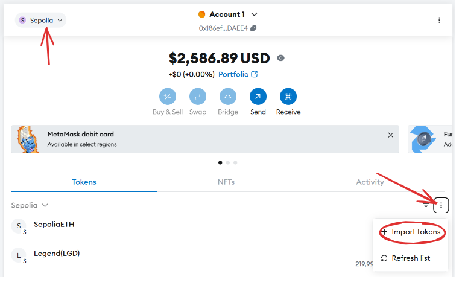

This a demo token and should not be use for production purposes.

run :
    ``npm install`` to install the dev dependencies.
    ``npx hardhat test`` to run the test
    ``npx hardhat run scripts/deploy.js --network sepolia`` to deploy the contract/token
    ``npx hardhat run scripts/airdrop.js --network sepolia`` to sign a tx using the terminal

 You can also add the token to metamask to sign tx more easily.

 

Make sure to have some Sepolia ETH to be able to perform tx.

If you wish to deploy the airdrop script, replace the recipient address with your friend.

 sepolia address .
